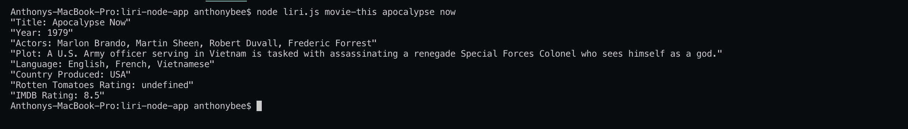
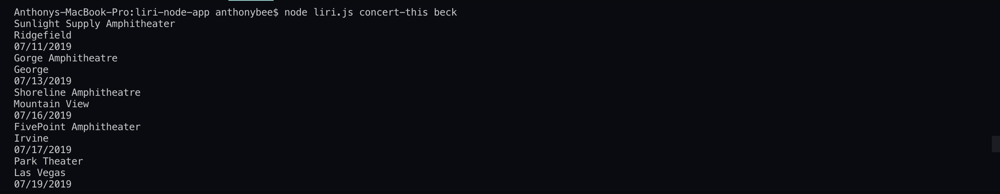
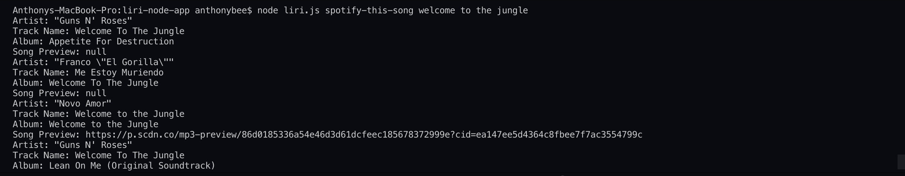
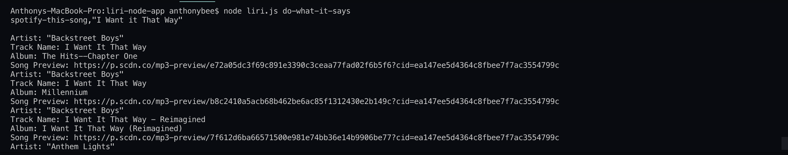

# liri-node-app
The Liri Node App is a command line node app that takes in user's parameters and returns data for movies, songs, and concerts. Users can input "movie-this" to get data on movies, "concert-this" to get data on upcoming concerts by an artist, "spotify-this-song" to get information on a specific song, or "do-what-it-says" to return commands from a text file.

#movie-this
When users choose to "movie-this", their input is called to the OMDB API which returns info on the movie title, year it was in theaters, main actors, a quick plot summary, different languages the movie is in, country produced, and both the Rotten Tomatoes and IMDB rating.

#concert-this
When a user prompts the app to "concert-this" in the command line they can get upcoming concert info for an artist. The prompt is followed by an artist query, which is sent to the Bands In Town API. Returned is the venue name, city the venue is located in, and the concert date and time.

#spotify-this-song
Users can "spotify-this-song" by entering this command into the command line, followed by the song query. The request is sent to the Spotify API, and returned is top information on the artist name, track name, album song is from, and a link to a song preview.

#do-what-it-says
When the user chooses to "do-what-it-says", a query is taken from the "random.txt" file, and the request is sent to its respective API. The user is then provided the appropriate response.

#Deployment
Liri Node App is a command line app that interact with the user through the command line through the Node.js run-time environment.

#Built With
Node.js  
Node-Spotify-API  
Axios npm  
DotEnv npm  
Moment JS npm  
JavaScript

#Authors
Tony Bee